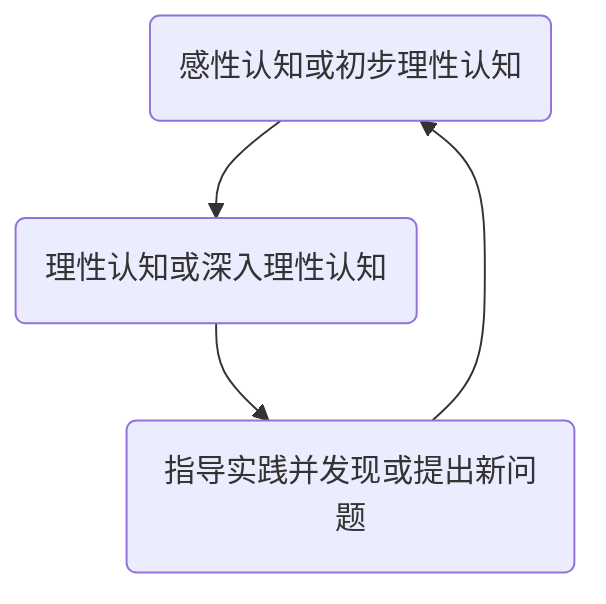

# 理论力学 绪论

## 一、什么是力学

力学是研究物体机械运动规律的科学。

> 物体的机械运动是指物体的空间体形（位置和形状）随时间的变化 移动、转动、流动和变形。
> 
> 力学的研究为揭示自然界中与机械运动有关的规律提供了有效的工具，它也是近代工程技术的重要理论基础之一。

## 二、力学是怎样发展的

力学的发展始终是和人类社会活动紧密联系的，力学的发展与完善推动了科学技术和社会的进步。

力学发展遵循认知规律：

## 三、力学的发展

### 1.建筑与桥梁

#### 早期筒体结构建筑

如比萨斜塔，从柱子得到启发。外圈是柱子，中间是圆形墙

#### 现代筒体结构建筑

如吉隆坡双塔大厦，去除了里面的墙，意识到墙可以不盖。高度452m，材料是钢筋混凝土。

#### 建筑物过高带来的问题

风载会引起高层建筑物的震动

             

#### 早期拱形建筑结构

如赵州桥，建于581-599年，跨度37.4m，拱高7m。

> [!TIP]
> 当时是世界上跨度最大的桥。
> 
> 敞肩拱（拱上拱）的运用是世界桥梁史上的首创，并有世界桥梁鼻祖的美誉。

古时拱桥、梁桥的拱高不会太高，跨度也不会太大，承载能力也很低。所以现在赵州桥成为了文物，只能看，不能通车，也不能过人。

#### 现代大跨度桥梁

衍生出各种桥梁，承载能力得到提升

#### 桥梁跨度过大带来的问题

悬索力度不够时，风会把桥吹扭曲，甚至断裂，此时风速低于设计最大承受风速也会把桥吹断。

> [!WARNING]
> 美国塔科马悬索桥事故
> 
> 此桥建于1940年，桥长853m。
> 
> 设计风速60m/s，破坏时测量得到风速只有19m/s。

人们往往从事故中总结教训。

在应对地震带来的破坏时，科学家发明了移动地基，可以吸收一部分地震能量，减轻地震对建筑物的破坏。还可以在顶楼安装减震器，使建筑物朝反方向震动（造价很高）。

            

### 2.机械手与机器人

机械手用于提高劳动强度，提高劳动精度，适用于人不能进入的环境中工作，或机械重复性动作。

机器人可分为步行机器人(从六足逐渐简化到一足)和轮型机器人

> 最开始研究六足是因为三只jio抬起后剩下三只支撑 比 四足抬起两只剩下两只支撑 更加稳固，更方便控制。

从分析研究人体的行走到双足步行机器人的实现，体现了力学、自动控制和计算机等科学技术的综合应用。

            

### 3.飞机与车辆

早期车辆主要解决动力问题，用机器取代人力马力。现在的汽车更加关注舒适（减震）、安全、高速、便捷、环保（减轻环境污染、噪音污染、光污染等）。汽车不断先进的同时，研究汽车动力学问题的手段也不断更新。人工智能、大数据、云计算的应用，使得自动驾驶技术正蓬勃发展。

早期的直升机只是原理的认识，能够起飞就以满足需求，由竹蜻蜓受到启发。

            

## 四、学习理论力学的目的

社会的发展与进步需要科学技术的不断发展与创新。

> [!COMMENT]
> 我们不能预言，哪类研究和纯理论探索会对我们社会的未来做出最大贡献。同样的，如果我们不能做出这样的预测，那么我们肯定可以自信地预言：新知识、新想法、新方法和智慧的思考对我们的未来将是至关重要的。
> 
> ——*哈佛校长L.H.Summers  2002.5 在北大的演讲*

            

## 五、理论力学的研究内容

- 静力学
  
  > 研究物体的平衡与力之间的关系

- 动力学
  
  > 研究物体的运动与力之间的关系

- 理论研究
  
  > 力学模型的建立
  > 
  > 力学中数学方法的研究
  > 
  > 力学问题的定性分析与定量分析

- 实验研究
  
  > 设计实验（检验模型、理论、结论的正确性）
  > 
  > 仿真实验（模拟和仿真系统的动力学行为）
  > 
  > 演示实验（揭示一些力学现象）

<!-- chat:start -->

#### **Friend**

这么卷的吗

#### **Dragonte**

其实这是我22年开学前就学过的一点(*￣︶￣)

<!-- chat:end -->